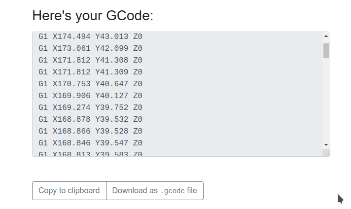

# Image2GCode

Converts an image to GCode using [svg2gcode](https://github.com/em/svg2gcode)
as the generator for the GCode. The image is first converted to an SVG
file and is then traced to GCode.

## Running the app

- Install [GraphicsMagick](http://www.graphicsmagick.org/) for your OS.
- Clone the repository and run `npm install`.
- Use `npm test` to check if everything is working fine.
- `npm start` starts the server. Go to `localhost:3000` in your favorite
  browser to generate the GCode for almost any JPG or PNG file.

Work is under progress to add many more options.
